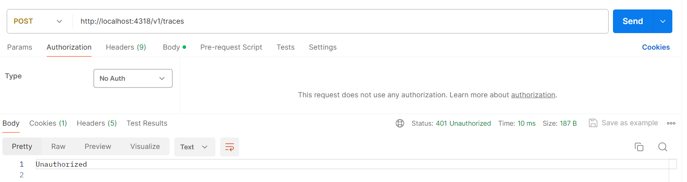
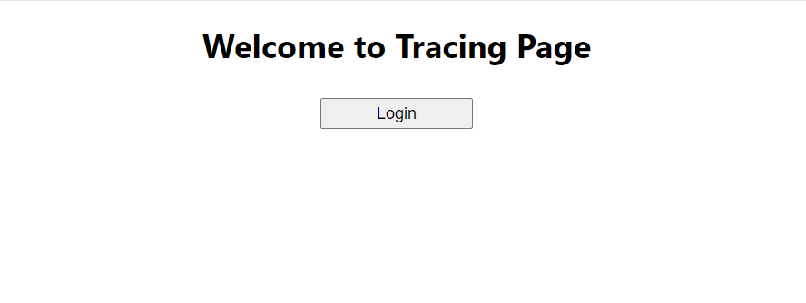
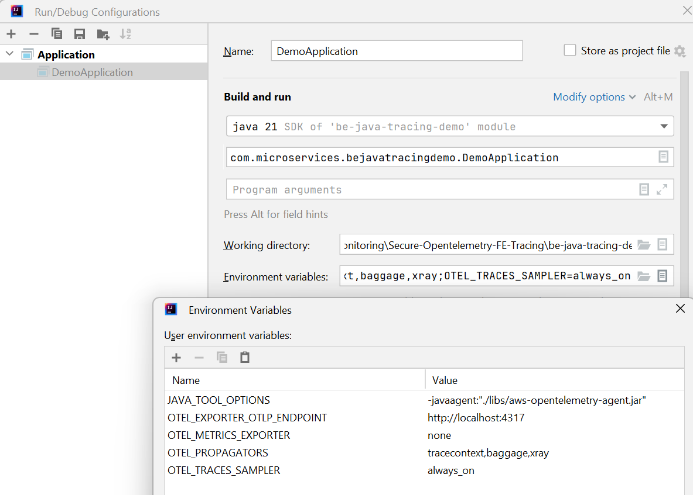
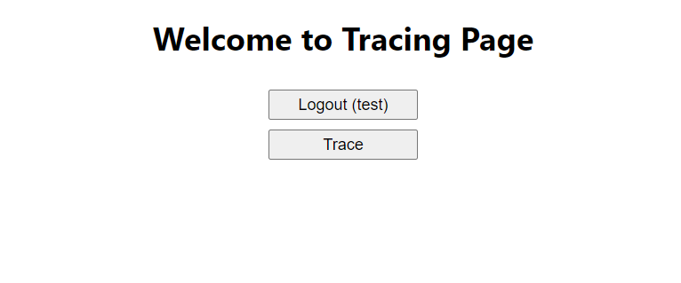
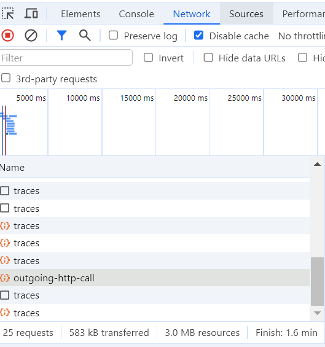
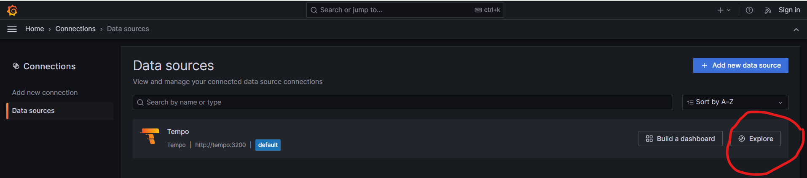
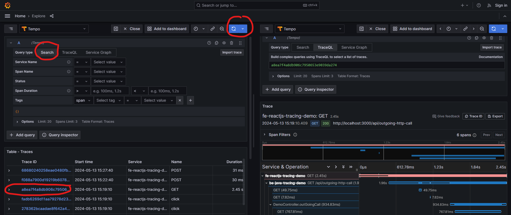

## **Steps to setup**
1/ Add keycloak host to your host file:

`127.0.0.1 identity`

2/ Go to folder `Secure-FE-Tracing-Opentelemetry` run `docker compose up`
The docker command will start
- Keycloak http://identity:8080/ with Import Realm data
  - Console Admin: admin / admin
  - Realm: opentelemetry
  - Client: fe-demo
  - User: test / password
- Opentelemetry Collector
  - The Collector exposes 2 ports according to 2 protocols GRPC and HTTP
  
    `ports:
    - "4317:4317" # OTLP gRPC receiver
    - "4318:4318" # OTLP http receiver`
  - FE uses port 4318 http://localhost:4318/v1/traces **with authentication** 
  - BE uses port 4317 http://localhost:4317/v1/traces **without authentication**
  - You can try to call the trace endpoint of FE in Postman with `No Auth`. it responses `401 Unauthorized`
  
  
- Grafana  http://localhost:4000/
- Grafana Tempo
- Postgresql

3/ Start FE Reactjs
- Open `fe-reactjs-tracing-demo` using Visual Studio Code (or any tool you are familiar with)
- Install `npm i -f`
- Start application `npm start`
- Verify FE by access http://localhost:3000

4/ Start BE Java Springboot application
- Open `be-java-tracing-demo` using IntelliJ IDE (or any other tool)
- Go to `Run -> Edit Configurations... -> Environment variables`. Add Environment variables below then Run BE application.

`JAVA_TOOL_OPTIONS=-javaagent:"./libs/aws-opentelemetry-agent.jar";
OTEL_EXPORTER_OTLP_ENDPOINT=http://localhost:4317;
OTEL_METRICS_EXPORTER=none;
OTEL_PROPAGATORS=tracecontext,baggage,xray;
OTEL_TRACES_SAMPLER=always_on;`

5/ Test tracing application
- Access http://localhost:3000 and login with user `test/password`
- After logged in, the trace button will appear

- Click Trace button then check Network tab. You will see that besides calling the BE `/api/outgoing-http-call`, FE also sends trace requests to the opentelemetry collector via the URL http://localhost:4318/v1/traces

- Access Grafana http://localhost:4000/ . Home -> Connections -> Data Sources -> Tempo -> Explore

- Choose Search -> Run Query -> Choose traceId, you will see a full trace from FE to BE 

