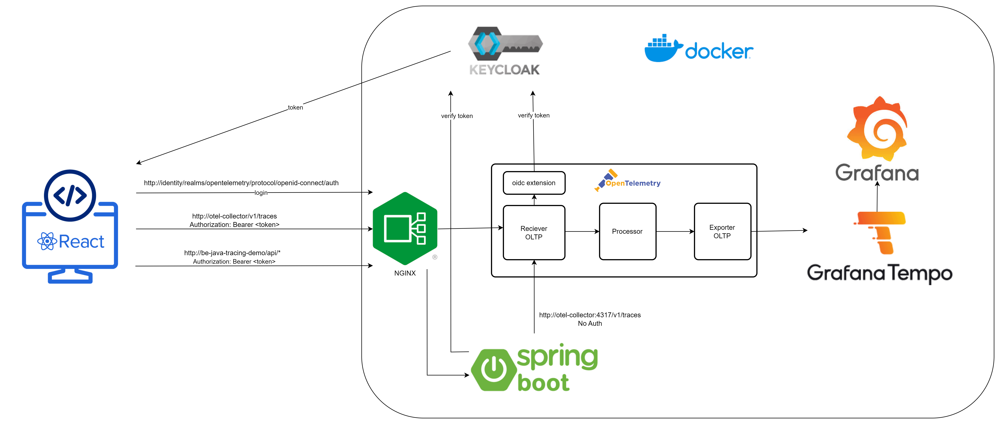
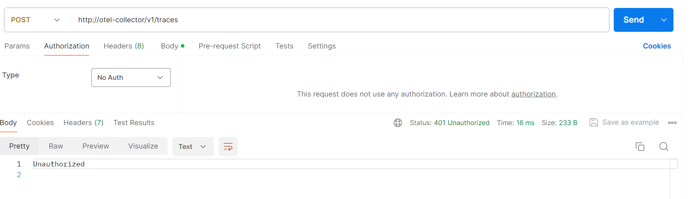
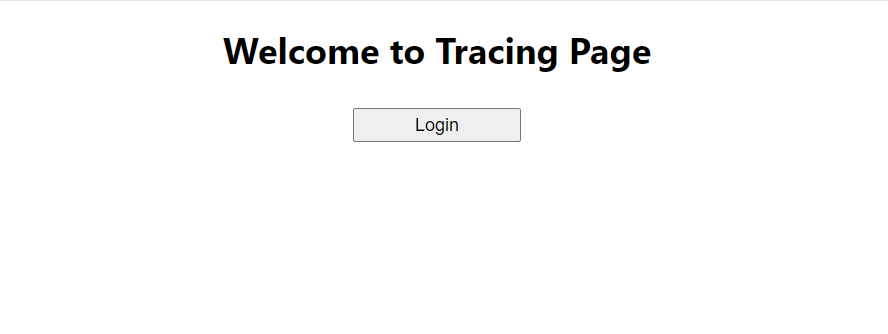
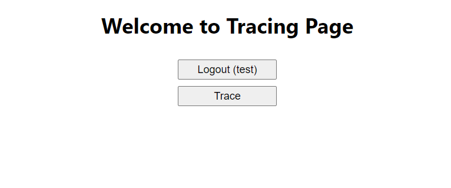
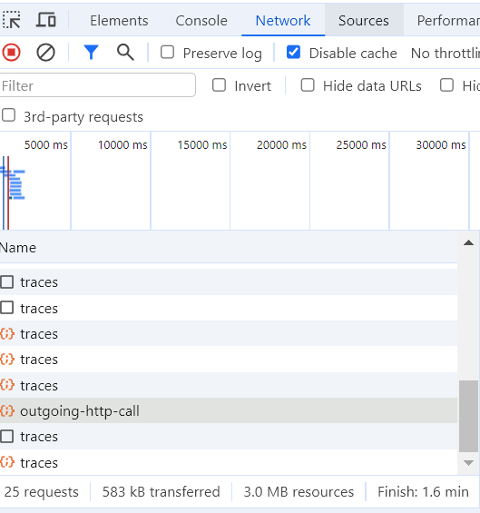
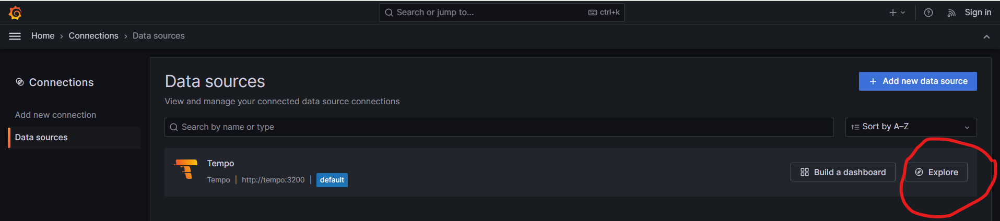
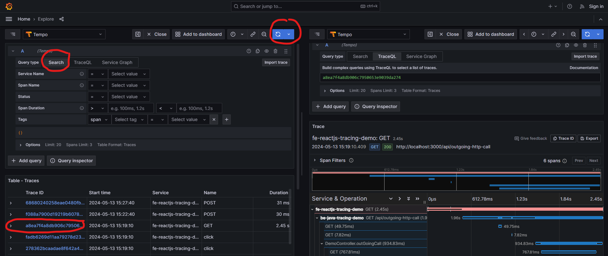

## **Architecture Overview**



## **Steps to setup**
**1. Add the following records to your host file:**
```
127.0.0.1 identity
127.0.0.1 be-java-tracing-demo
127.0.0.1 otel-collector
127.0.0.1 grafana
127.0.0.1 tempo
```
**2. Start docker compose** 
Go to folder `Secure-FE-Tracing-Opentelemetry` run `docker compose up` .The command will start following containers
- Keycloak http://identity/ with Import Realm data
```
Console Admin: admin / admin
Realm: opentelemetry
Client: fe-demo
User: test / password
```
- Nginx exposes otel-collector, keycloak and backend URL
```
server {
  server_name identity;
  location / {
	proxy_pass http://identity:8080;
  }
}
server {
  server_name otel-collector;
  location / {
	proxy_pass http://otel-collector:4318;
  }
}
server {
  server_name be-java-tracing-demo;
  location / {
	proxy_pass http://be-java-tracing-demo:8000;
  }
}
```
- Opentelemetry Collector has an OpenID Connect extension (uses Keycloak as OAuth Server) to verify token received from http
```
extensions:
  oidc:
    issuer_url: http://identity:8080/realms/opentelemetry
    audience: account
    attribute: Authorization

receivers:
  otlp:
    protocols:
      grpc:
      http:
        auth:
          authenticator: oidc
```
  
  BE sends traces via port gRPC 4317 without Authorization.
  FE send traces via port http 4318 with Authorization Bearer Token.
  http://otel-collector:4318 is exposed as http://otel-collector by Nginx. You can test Authorization by calling endpoint in Postman with `No Auth`. it responses `401 Unauthorized`
  

- BE java (be-java-tracing-demo) to demo tracing API
- Grafana  http://grafana:4000/
- Grafana Tempo
- Postgresql

3. Start FE Reactjs
- Open `fe-reactjs-tracing-demo` using Visual Studio Code (or any tool you are familiar with)
- Install `npm i -f`
- Start application `npm start`
- Verify FE by access http://localhost:3000



4. Test tracing application
- click **Login** button then login with user `test/password`
- After logged in, the **Trace** button will appear

- Click Trace button then check Network tab. You will see that besides calling the BE `/api/outgoing-http-call`, FE also sends trace requests to the opentelemetry collector via the URL http://otel-collector/v1/traces


- Access Grafana http://grafana:4000/ . Home -> Connections -> Data Sources -> Tempo -> Explore


- Choose Search -> Run Query -> Choose traceId, you will see a full trace from FE to BE 



